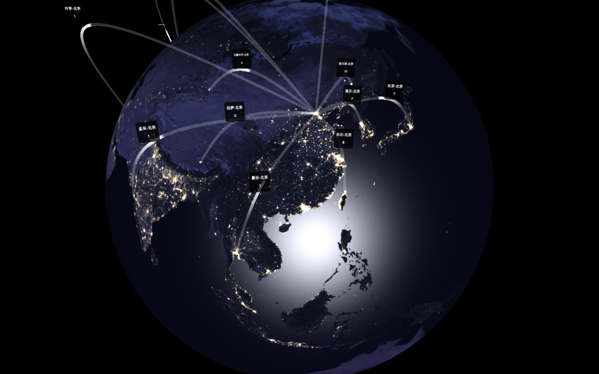
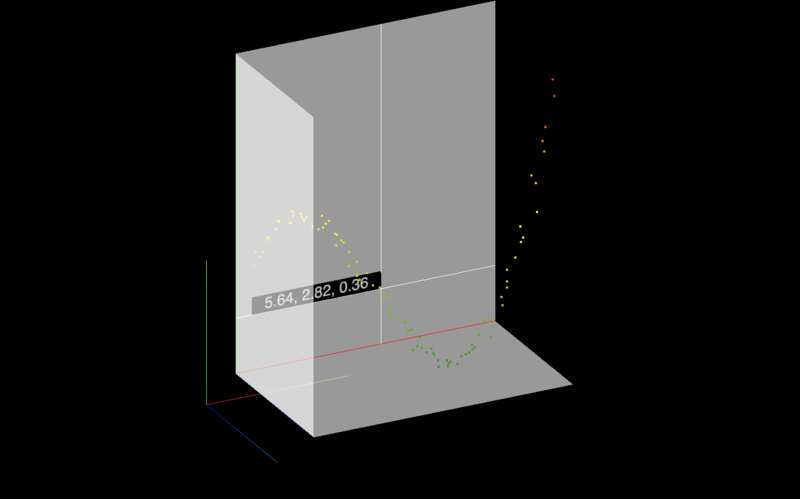

3D charts library, using Three.js

# Features

- bar-chart
- bar-chart-2-args
- china-province-bar-chart
- city-route-chart
- scatter-chart
- tile-map-tool





# Demos online

https://zhaokang555.github.io/three-d-charts-demos

# Install

## Use npm

`npm i three-d-charts --save`

```js
import {BarChart, BarChart2Args, ChinaProvinceBarChart, CityRouteChart, ScatterChart, tileMapTool} from 'three-d-charts';
```

## Global import in browser

```html
<script src="path/to/three-d-charts"></script>
<script>
const {BarChart, BarChart2Args, ChinaProvinceBarChart, CityRouteChart, ScatterChart, tileMapTool} = window.ThreeDCharts;
</script>
```

# API

```ts
class BarChart {
    constructor(list: IList, container: HTMLElement);
    render: () => void;
    clean(): void;
}
class BarChart2Args {
    constructor(lists: Array<IList>, container: HTMLElement);
    render: () => void;
    clean(): void;
}
class ChinaProvinceBarChart {
    constructor(list: IList, container: HTMLElement);
    render: () => void;
    clean(): void;
}
class CityRouteChart {
    constructor(list: Array<IRoute>, container: HTMLElement, extraCities: Array<ICity> = []);
    render: () => void;
    clean(): void;
}
class ScatterChart {
    constructor(list: Array<IPosition>, container: HTMLElement);
    render: () => void;
    clean(): void;
}
tileMapTool: (tileWidth = 3600, tileHeight = 3600, colIdxOffset = 0, rowIdxOffset = 0) => HTMLInputElement

// types and interfaces
type IList = Array<{
  key: string;
  value: number;
}>;
interface IRoute {
    from: string;
    to: string;
    weight: number;
}
interface ICity {
    name: string;
    coordinates: ICoordinates;
}
type ICoordinates = [number, number];
```

# Local run demos

- `npm i`
- `npm run dev`
- open `localhost:1234/index.html`

# Build demos
- `npm run build:demos`
note: remember move `three-d-charts-demos/Alibaba_PuHuiTi_Regular.json` to your server `/` path since I used `parcel-plugin-static-files-copy`